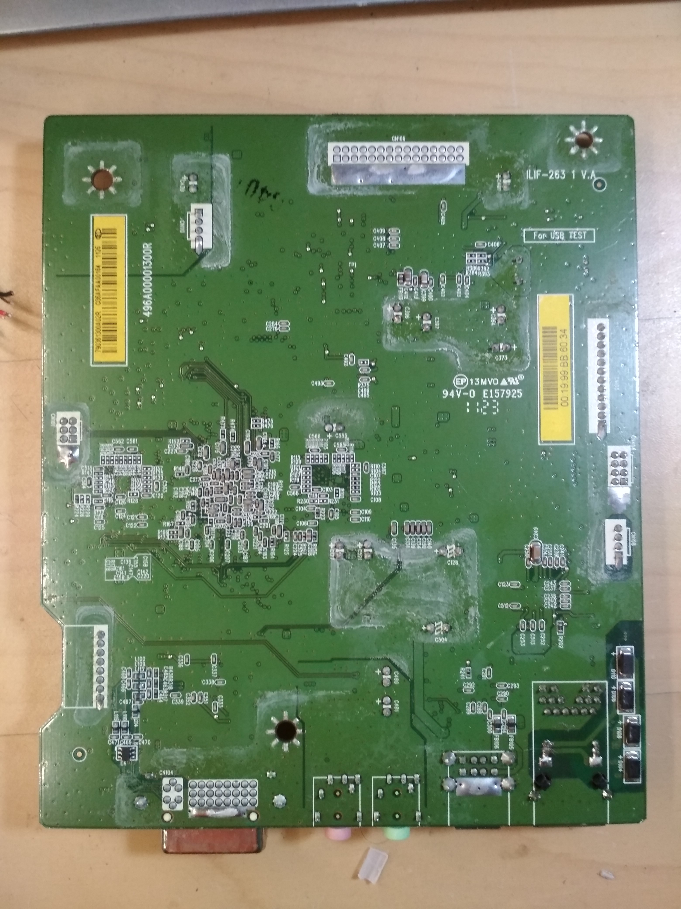

# Fujitsu zeroclient dz22-2 main board

## front

1. PoE output to power supply
2. front panel (buttons)
3. power supply
4. LCD display
5. speakers
6. USB ports
7. unused connector, probably JTAG.

## back

## power supply connector

1. 5V
2. NC
3. 5V
4. 5V
5. Ground
6. Ground
7. EAN1
8. DIM1
9. NC
10. NC
11. NC
12. SAVING ON/OFF
13. Ground

